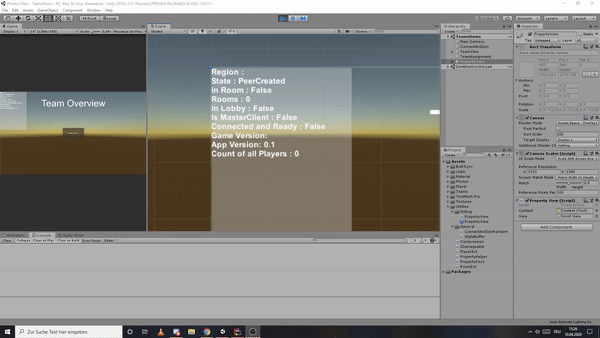
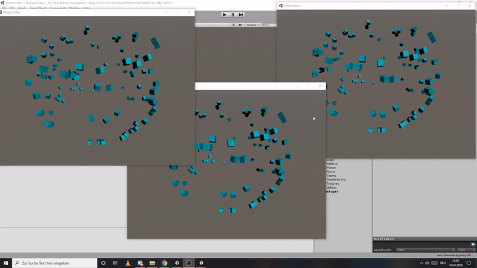
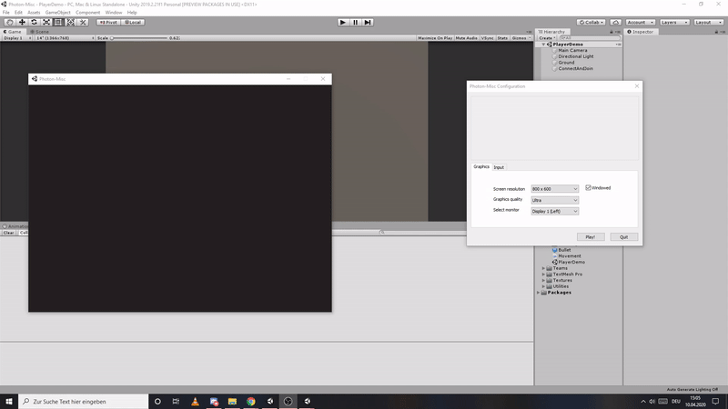
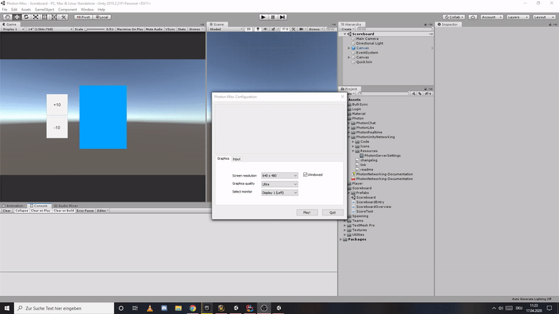

## Photon Misc

Stuff I made and id like to share because i think it could be usefull . Also for me later on :)

#### [Property Wrapper](https://github.com/SradnickDev/Photon-Misc/blob/master/Assets/Utilities/PropertyHelper.cs "Property Wrapper")
- simplifies room and player properties

#### [Teams](https://github.com/SradnickDev/Photon-Misc/tree/master/Assets/Teams/ "Teams")
- simple extension for team management assignment
- fixed team size, unlimited team count
- equal team fill
- room and player extension to access  the properties

#### [Property View](https://github.com/SradnickDev/Photon-Misc/tree/master/Assets/Utilities/Debug/ "Property View")
- to easily debug clients
- shows connection ,room, player related data

#### [Bulk Batch Sync](Assets/BulkSync/ "Bulk Batch Sync")
I used this in a project with some constraints.
It creates a pretty small package with position and rotation data from 50 units.
Serialize / Deserialize it and takes care of sending,receiving and buffering.
I achieved good results with 100 units and 3 player.
Reduced traffic and msg/s.
- basically to synchronize a lot of units
(wip)

#### [Authentication(login/register)](Assets/Login/ "Authentication(login/register)")
- [php code](PHPAccountFiles " php code") for login and registration
- salt n pepper for security
- for use with photon authentication, so your account has to be setup properly
- file to create a db
- simple login demo scene

#### [Basic Health & Shooting](Assets/Player/ "Basic Health & Shooting")
- basic out of the box solution

####  [State Buffer](Assets/Utilities/General/StateBuffer.cs "StateBuffer")
- to improve synchronisation without extra dependency
- interpolation / extrapolation
- smooth movement

#### [Data Compression/Packing](Assets/Utilities/Compression.cs "Data Compression/Packing")
- vector3 down to 4 byte
- quaternion down to 4 byte
- vector2 down to 4 byte

#### [Ready check after Scene Load](Assets/Utilities/ReadyOnSceneLoaded.cs "Ready check after Scene Load")
- simple way to emit that one client is done with scene loading

#### Player Spawn - Spawnpoints
- using events to spawn player 
(comming soon)

#### [Scoreboard](Assets/Scoreboard/ "Scoreboard")
- basic scoreboard

